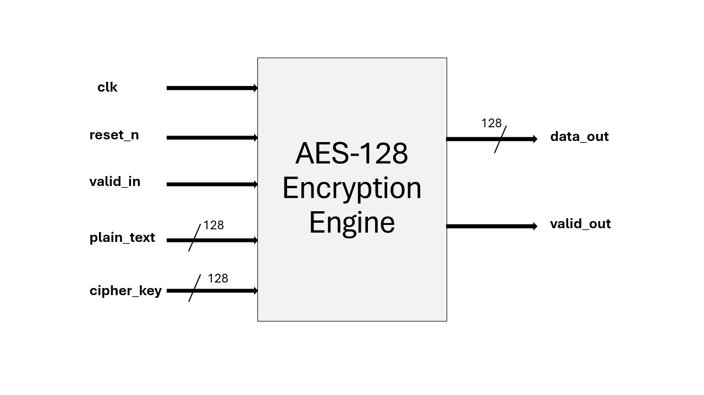
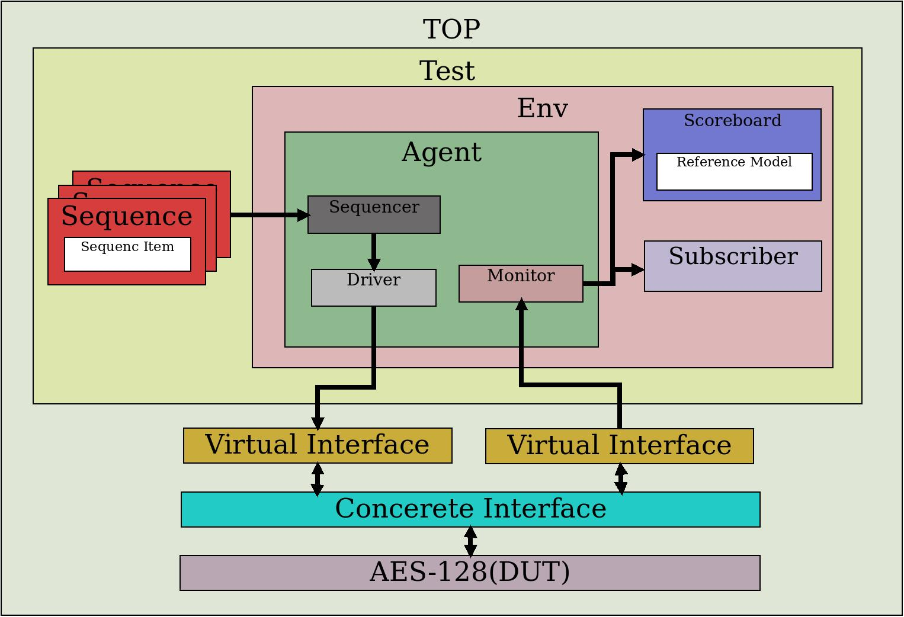

# AES-128 Encryption Engine Verification using UVM

## Overview
This project involves the verification of an AES-128 Encryption Engine using the Universal Verification Methodology (UVM). The AES-128 encryption engine is a hardware block that takes in a 128-bit plaintext and a 128-bit cipher key to produce a 128-bit encrypted output (ciphertext).

## Block Diagram
The block diagram of the AES-128 Encryption Engine is as follows:



## Verification Environment

### 1. Testbench Architecture
The UVM testbench is composed of several components to facilitate the verification process. The key components include:



- **Top**: This is the top-level component that controls the execution of the verification environment and instantiate the DUT.
- **UVM Test**: It sets up the test environment and initiates the stimulus (Sequences).
- **UVM Environment (Env)**: The environment contains the agents, scoreboard and Subscriber.
- **UVM Agent**: The agent contains a sequencer, driver and monitor.
  - **Sequencer**: Receives the sequences of input transactions to be applied to the DUT.
  - **Driver**: Converts transactions from the sequencer into pin-level signals that are applied to the DUT.
  - **Monitor**: Observes the pin-level signals and converts them back into transactions that can be analyzed.
- **UVM Scoreboard**: Used to compare the expected results with the actual outputs from the DUT inside scoreboard there is a reference model.
- **UVM Subscriber**: Used to collect coverage.
- **DUT (Design Under Test)**: The AES-128 Encryption Engine being verified.

### 2. Stimulus Generation
The stimulus generation is handled by the UVM sequence, which drives different sequences of data, such as:
- Resetting the DUT.
- Randomized sequences to explore different input combinations.

### 3. Coverage Collection
Functional coverage is collected to ensure that all parts of the AES algorithm are exercised. The coverage model includes:
- **Control Signal Coverage**: Coverage on signals like `valid_in`, `reset_n` and clock cycles during operation.
- **Input Data Coverage**: Coverage on different values of `plain_text` and `cipher_key`.
- **Output Data Coverage**: Coverage on different values of `data_out` and `valid_out`.

### 4. Assertions
SystemVerilog assertions (SVA) are used to validate the protocol and timing of the AES-128 engine. Key assertions include:
- Checking the validity of input signals.
- Ensuring data output is only valid when `valid_out` is asserted.
- Correctness of encryption output based on known test vectors.

## Running the Verification

### 1. Prerequisites
Ensure that you have the following tools installed:
- **SystemVerilog Simulator** (e.g., VCS, QuestaSim, etc.)
- **UVM Libraries** (e.g., UVM 1.1d, UVM IEEE-1800, etc. )
- **Python** (with AES supported)

### 2. Setting Up the Environment
1. Clone the repository.
2. Set up the UVM environment by configuring your simulator to include the UVM libraries.

### 3. Executing Tests
Run the tests using the following command:
```sh
do run.do
